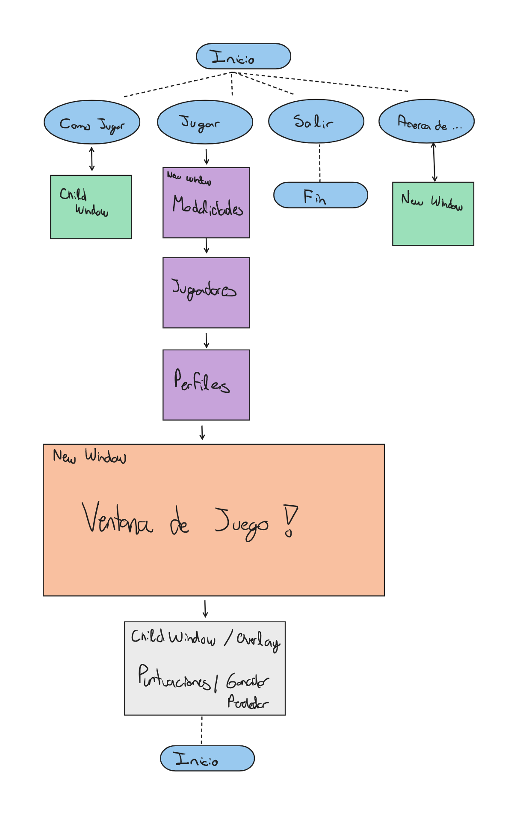
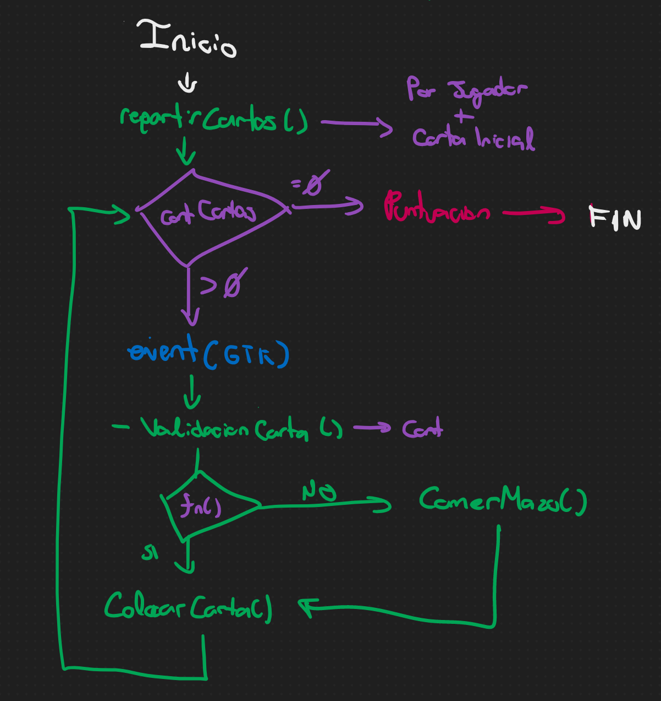

# Proyecto Final
## Juego Desarrollado : "UNO"

A medida de que se avance en el proyecto, iremos documentando a este mismo.
Por ejemplo, podemos documentar que hace una funcion, los archivos en el directorio, librerias que ocupamos, etc.

---
# Graficos
Por el momento estamos ocupando **"The GTK Project"**,
El Fichero `HelloWorld.c` es un ejemplo simple para ver la compilacion de esta libreria.

# Valores Standard
## Medidas de la ventana:
    - 720p (1280x720)

## Paletas de colores (HEX):
El orden es el mismo de la lista siguiente.
    - Rojo    : #ec6464
    - Verde   : #64bb8e
    - Azul    : #2dbbde
    - Amarillo: #f7e359

# Flujo de Ventanas

# Acciones
## Menus de Prejuego
1. Al presionar el boton "Jugar", cerrar la ventana principal.
2. Abrir "SelectMode", al presionar "Modo Local", cerrar ventana "SelectMode"
3. Abrir "SelectPlayer", guardar que cuantos jugadores y definir el estilo de juego, cerrar ventana "SelectPlayer"
4. Abrir "ProfileBuild", guardar la imagen y nombres de los jugadores en la struct, cerrar ventana y repetir las veces de los # de jugadores
5.  Abrir "GAMESTART"

## Inicio del JUEGO
1. Se reparten 7 cartas a cada JUGADOR
    - Se ocupa el mismo metodo POR JUGADOR (Debe ser dinamico para evitar tantas lineas)
2. Se saca una carta random para INICIAR
3. Mantener un contador que sepa el turno de cada jugador
4. Cuando le toque al JUGADOR y haga CLICK en una carta entonces hacer la verificacion
    - Si es del mismo COLOR O es del mismo NUMERO, entonces es valido para poner
    - Si no entonces no dejar que la ponga en la mesa (Ya sea que despliegue un error (popout) / descativar el boton de la carta (Hacerla INSENSITIVE))
    - Si de plano no tiene niguna carta, hacer que coma del MAZOCOMIDA hasta que le salga una carta valida
        - Cada vez que coma, la carta comida debe tener un ID aumentado a 1 (Ya sea que se asigne automaticamente por medio del GLIST o que le pongamo un nombre al widget GTK_EVENT)
5. Pasar al siguiente turno, aumentando el contador del PASO 3 y repitiendo
6. Se acaba el juego cuando algun JUGADOR no tenga ninguna carta.
    - Cada vez que termine un turno se compreuba el tamaño del arreglo de cartas (BARAJA)
7. Pasar a ventana de Puntuaciones / Victoria / Derrota
8. FIN

### Arbol

